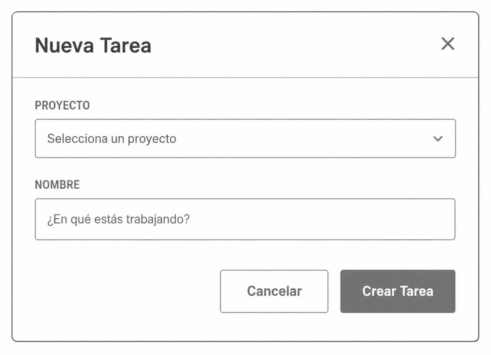
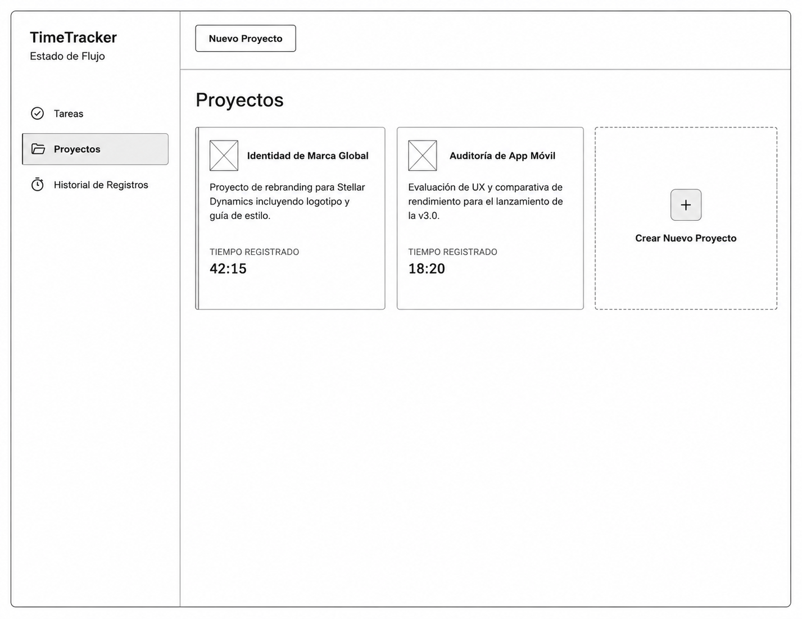
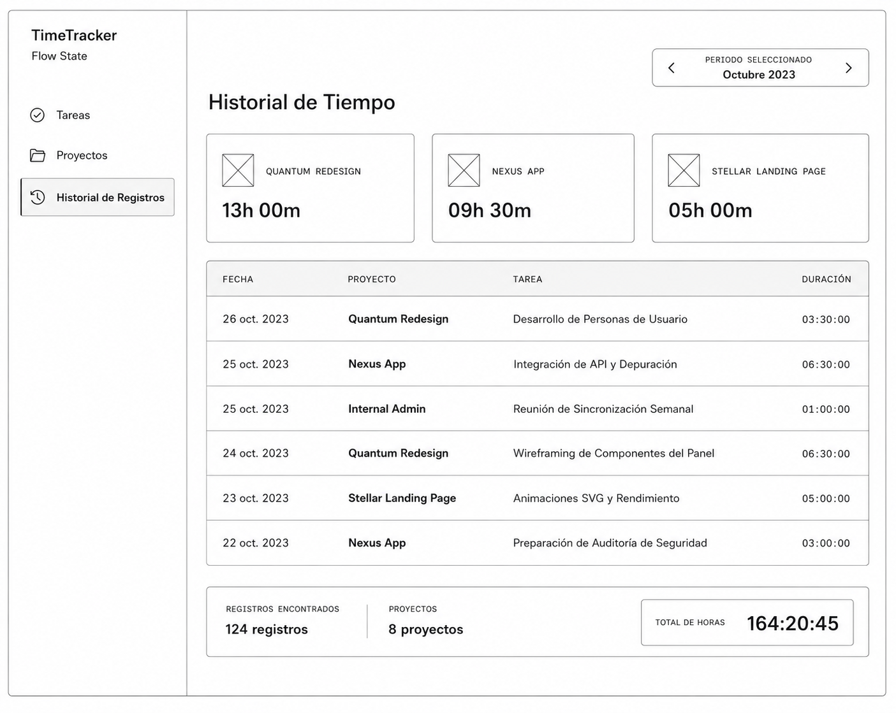

# Especificación de Requisitos de Software (SRS) para Time Tracker

# 1. Introducción

### 1.1 Propósito

El propósito de este documento es especificar los requisitos de software para la aplicación "Time Tracker". Esta herramienta está diseñada para uso personal, permitiendo a los usuarios registrar el tiempo dedicado a diversas tareas dentro de proyectos. La aplicación facilitará el registro de tiempo tanto en tiempo real (mediante un temporizador) como de forma diferida (ingreso manual), y proporcionará una visualización de los totales de tiempo acumulados por mes. Este documento también sirve como un ejercicio para aplicar los principios de diseño y wireframes definidos en DESIGN.md para asegurar que la interfaz de usuario respete los tokens, patrones y el diseño acordados antes de la implementación.

### 1.2 Alcance

El sistema "Time Tracker" se enfocará exclusivamente en el flujo principal de gestión del tiempo y proyectos. Esto incluye:

- Creación y gestión de Proyectos y Tareas.
- Registro de tiempo automatizado (funcionalidades de Iniciar/Detener temporizador).
- Registro de tiempo manual.
- Visualización de horas acumuladas e historial de datos por tarea y proyecto.

### 1.3 Definiciones, acrónimos y abreviaturas

- Proyecto: Una agrupación lógica de tareas relacionadas. Un proyecto puede contener múltiples tareas.
- Tarea: Una unidad de trabajo específica que se asocia obligatoriamente a un único proyecto.
- Registro de Tiempo: Una entrada que documenta el tiempo dedicado a una tarea, ya sea a través de un temporizador o de forma manual.
- Temporizador: Funcionalidad que permite registrar el tiempo en tiempo real, con inicio y fin definidos.

### 1.4 Referencias

- [DESIGN.md](https://github.com/HectorAndradeBayteq/taller-sdd/blob/master/etapa-2/assets/DESIGN.md) – Sistema de diseño del laboratorio con paleta, tipografía, espaciado y patrones de componentes.

### 1.5 Visión general del documento

Este documento está organizado en cuatro secciones principales. La Sección 1 proporciona una introducción al "Time Tracker", su propósito, alcance, definiciones y referencias. La Sección 2 describe la perspectiva general del producto, sus funciones, usuarios y restricciones. La Sección 3 detalla los requisitos específicos, incluyendo funcionales, de interfaz externa y atributos de calidad. Finalmente, la Sección 4 contiene información de apoyo como apéndices e índice.

## 2. Descripción general

### 2.1 Perspectiva del producto

"Time Tracker" es una aplicación independiente diseñada para ser utilizada por individuos para gestionar su tiempo personal. No se integra con otros sistemas externos de gestión de proyectos o calendarios. Su principal característica es el almacenamiento local de todos los datos, lo que garantiza un funcionamiento "offline-first".

### 2.2 Funciones del producto

Las funciones principales del producto incluyen:

- Gestión de Proyectos: Creación, edición y visualización de proyectos.
- Gestión de Tareas: Creación, edición y asociación de tareas a proyectos.
- Registro de Tiempo Automatizado: Inicio, pausa y detención de temporizadores para tareas.
- Registro de Tiempo Manual: Ingreso de tiempo dedicado a tareas de forma manual.
- Visualización de Reportes: Presentación de totales de tiempo acumulado por tarea, proyecto y mes.

### 2.3 Características de los usuarios

Los usuarios de "Time Tracker" son individuos que buscan una herramienta sencilla y eficiente para monitorear y gestionar el tiempo que dedican a sus actividades. Se espera que los usuarios tengan un conocimiento básico de cómo interactuar con aplicaciones móviles o web y estén interesados en mejorar su productividad personal.

### 2.4 Restricciones

- Persistencia de Datos: Toda la información del sistema (Proyectos, Tareas y Registros de Tiempo) debe persistirse exclusivamente en el almacenamiento local del dispositivo. Esto asegura el funcionamiento sin conexión a internet (offline-first).
- Concurrencia del Temporizador: El sistema solo permitirá un (1) temporizador activo ("en ejecución") a la vez en toda la aplicación.
- Relación Tarea-Proyecto: Una Tarea debe pertenecer obligatoriamente a un único Proyecto.
- Relación Registro-Tarea: Un Registro de Tiempo debe pertenecer obligatoriamente a una única Tarea.
- Duración de Registros: No se permiten duraciones menores o iguales a cero para ningún tipo de registro de tiempo.

### 2.5 Suposiciones y dependencias

- Se asume que los usuarios tienen acceso a un dispositivo (móvil o web) con capacidad de almacenamiento local.
- Se asume que el usuario comprende el concepto de proyectos y tareas para organizar su trabajo.
- El diseño de la interfaz de usuario dependerá del sistema de diseño DESIGN.md y los wireframes proporcionados.

## 3. Requisitos específicos

### 3.1 Requisitos funcionales

#### 3.1.1 Gestión de Proyectos y Tareas

- RF-001: El sistema deberá permitir al usuario crear un nuevo Proyecto, ingresando un Nombre (obligatorio) y una Descripción (opcional).
- RF-002: El sistema deberá almacenar los datos del Proyecto en el almacenamiento local del dispositivo.
- RF-003: El sistema deberá permitir al usuario crear una nueva Tarea, asociándola a un Proyecto existente y proporcionando un Nombre para la Tarea.
- RF-004: El sistema deberá almacenar los datos de la Tarea en el almacenamiento local del dispositivo, incluyendo su asociación al Proyecto.

#### 3.1.2 Control de Tiempo Automatizado

- RF-005: El sistema deberá permitir al usuario iniciar un temporizador para una Tarea específica.
- RF-006: Al iniciar un temporizador, el sistema deberá guardar localmente el estado "En Ejecución" junto con la hora de inicio y el identificador de la Tarea.
- RF-007: Si un temporizador se inicia mientras otro está activo en una Tarea diferente, el sistema deberá detener automáticamente el temporizador anterior, calcular y guardar su registro de tiempo antes de iniciar el nuevo.
- RF-008: El sistema deberá permitir al usuario detener el temporizador activo.
- RF-009: Al detener el temporizador, el sistema deberá registrar la Hora Fin, calcular la Duración (Hora Fin - Hora Inicio) y persistir el Registro de Tiempo de forma inmediata en el almacenamiento local.
- RF-010: El sistema deberá validar que la Duración calculada sea mayor que cero.

#### 3.1.3 Ingreso Manual y Reportes

- RF-011: El sistema deberá permitir al usuario crear un Registro de Tiempo manual para una Tarea, ingresando la Tarea, la Fecha y la Duración.
- RF-012: El sistema deberá persistir el Registro de Tiempo manual en el almacenamiento local.
- RF-013: El sistema deberá validar que la Duración ingresada manualmente sea mayor que cero.
- RF-014: El sistema deberá leer y mostrar en la interfaz el historial de todos los Registros de Tiempo.
- RF-015: El sistema deberá calcular y mostrar los totales de tiempo acumulado por Tarea.
- RF-016: El sistema deberá calcular y mostrar los totales de tiempo acumulado por Proyecto (suma de los tiempos de sus Tareas).
- RF-017: El sistema deberá calcular y mostrar los totales de tiempo acumulado por mes.

### 3.2 Requisitos de interfaz externa

#### 3.2.1 Interfaces de usuario

- RIU-001: La interfaz de usuario deberá adherirse al sistema de diseño DESIGN.md (tema Precision Focus) en cuanto a paleta de colores, tipografía, espaciado y patrones de componentes.
- RIU-002: La interfaz de usuario deberá implementar los diseños presentados en los wireframes para las vistas de "Tareas (panel principal)", "Nueva Tarea" y "Proyectos".
- RIU-003: La interfaz de usuario deberá proporcionar una navegación lateral para acceder a las diferentes secciones (e.g., Tareas, Proyectos).
- RIU-004: La interfaz de usuario deberá mostrar claramente el estado del temporizador (activo/inactivo) y la tarea asociada.

#### 3.2.2 Interfaces de hardware

No se especifican requisitos de interfaz de hardware específicos más allá de los que son inherentes al dispositivo donde se ejecute la aplicación (e.g., pantalla táctil, teclado, ratón).

#### 3.2.3 Interfaces de software

No se especifican interfaces de software externas. La aplicación funcionará de forma autónoma utilizando el almacenamiento local del dispositivo.

#### 3.2.4 Interfaces de comunicación

No se especifican requisitos de interfaces de comunicación, ya que la aplicación está diseñada para funcionar "offline-first" y no requiere conexión a internet para sus funcionalidades principales.

### 3.3 Requisitos de rendimiento

- RP-001: El sistema deberá iniciar el temporizador en menos de 1 segundo desde la acción del usuario.
- RP-002: El sistema deberá detener el temporizador y persistir el registro en menos de 1 segundo desde la acción del usuario.
- RP-003: La visualización de los reportes de tiempo (por tarea, proyecto, mes) deberá cargarse en menos de 2 segundos para un volumen de datos razonable (e.g., 1000 registros).

### 3.4 Restricciones de diseño

- RD-001: El diseño de la aplicación deberá basarse en el sistema de diseño DESIGN.md y los wireframes proporcionados.
- RD-002: La aplicación deberá ser desarrollada para funcionar con almacenamiento local exclusivamente.

### 3.5 Atributos del sistema de software (Calidad)

#### 3.5.1 Fiabilidad

- RFB-001: El sistema deberá garantizar la persistencia de todos los datos (Proyectos, Tareas, Registros) en el almacenamiento local, incluso en caso de cierre inesperado de la aplicación o del dispositivo.
- RFB-002: El sistema deberá recuperar los datos almacenados localmente de forma consistente tras un reinicio de la aplicación.

#### 3.5.2 Disponibilidad

- RDP-001: La aplicación deberá estar disponible para su uso sin conexión a internet.

#### 3.5.3 Seguridad (Security)

- RSG-001: El sistema no deberá requerir autenticación de usuario, ya que es una herramienta de uso personal y local.
- RSG-002: El sistema no deberá transmitir datos sensibles a través de la red, dado su enfoque de almacenamiento local.

#### 3.5.4 Mantenibilidad

- RMT-001: El código fuente deberá seguir las mejores prácticas de desarrollo y ser modular para facilitar futuras modificaciones y extensiones.

#### 3.5.5 Portabilidad

- RPT-001: La aplicación deberá ser compatible con múltiples plataformas (web, móvil) si se desarrolla con tecnologías multiplataforma (e.g., React Native, Flutter, PWA).

### 3.6 Otros requisitos

No se identifican otros requisitos específicos fuera de las categorías anteriores en este momento.

## 4. Información de apoyo

### 4.1 Apéndices

- Apéndice A: Wireframes de la Interfaz de Usuario
- Pantalla de Tareas

- Modal de creación y edición de tareas

- Pantalla de proyectos

- Historial de registros

