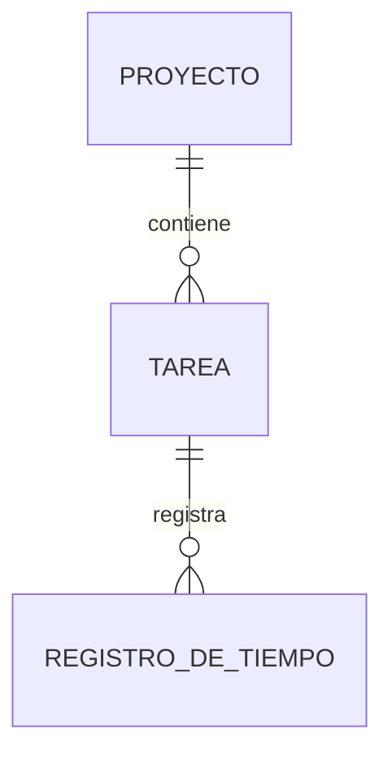
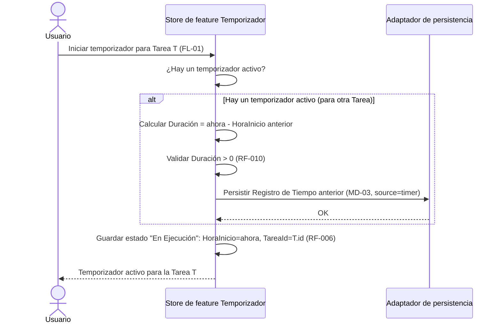
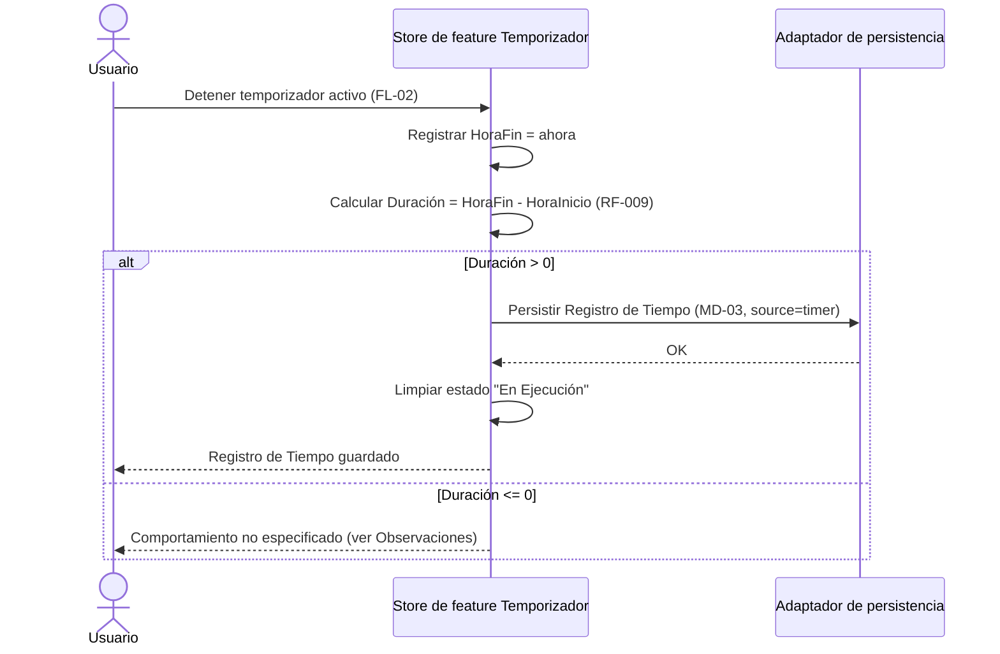
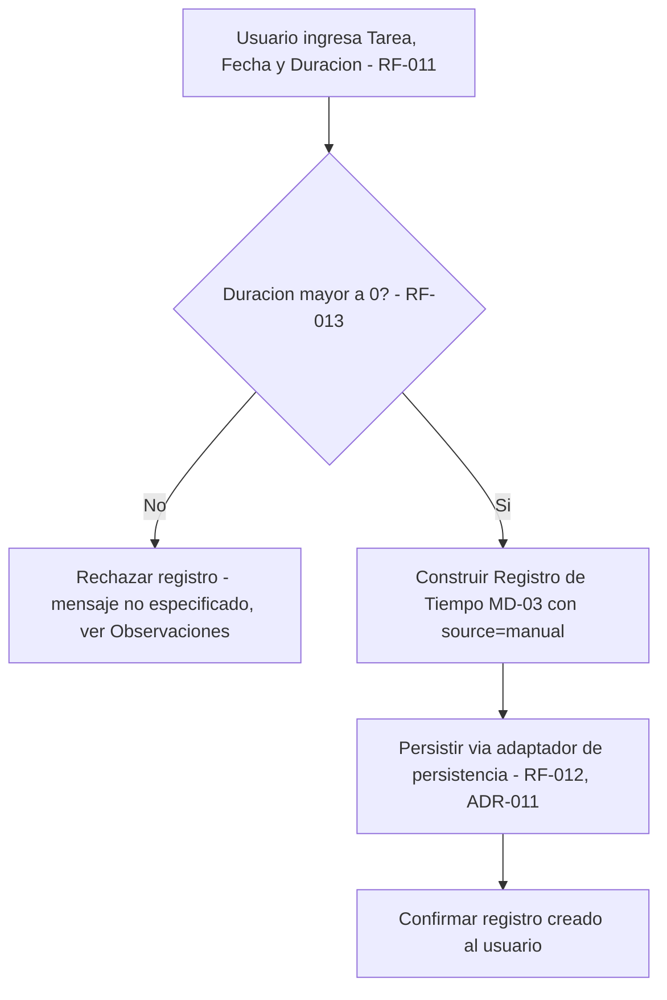
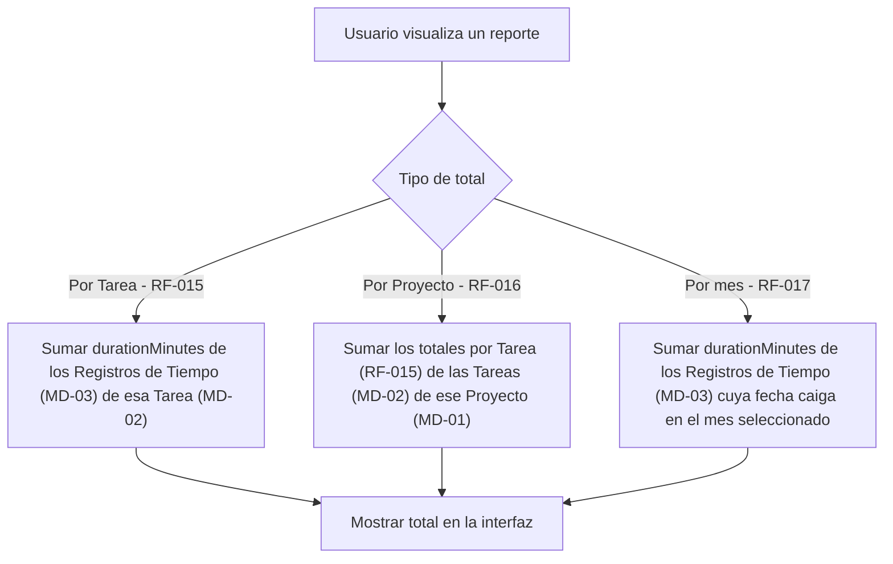
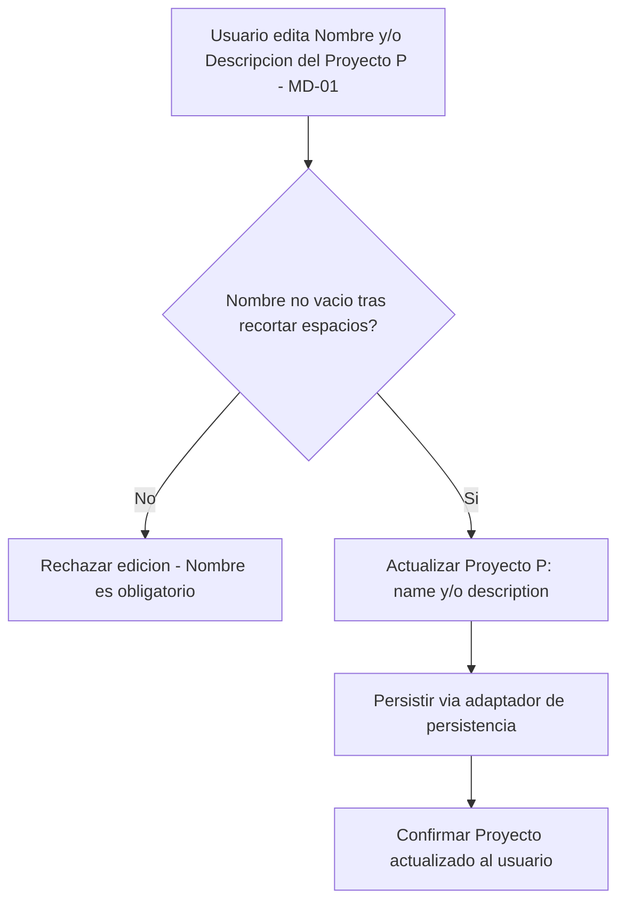
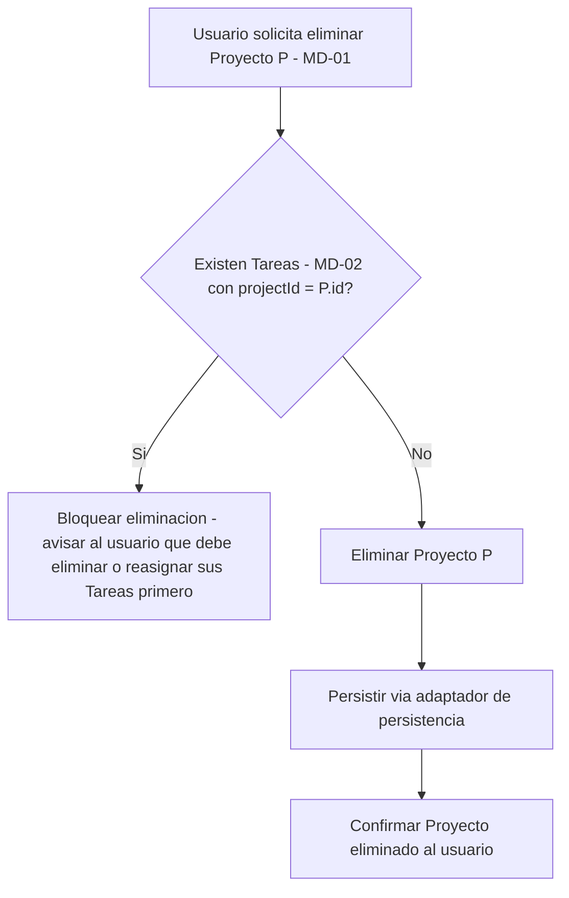
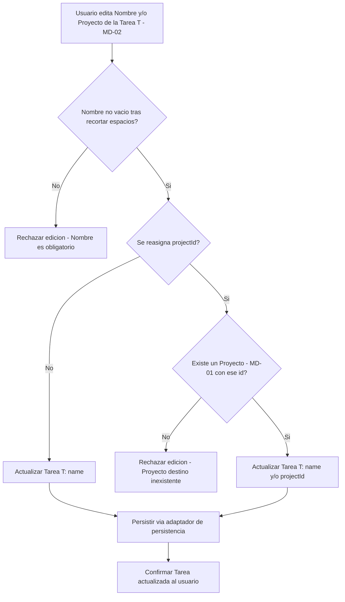
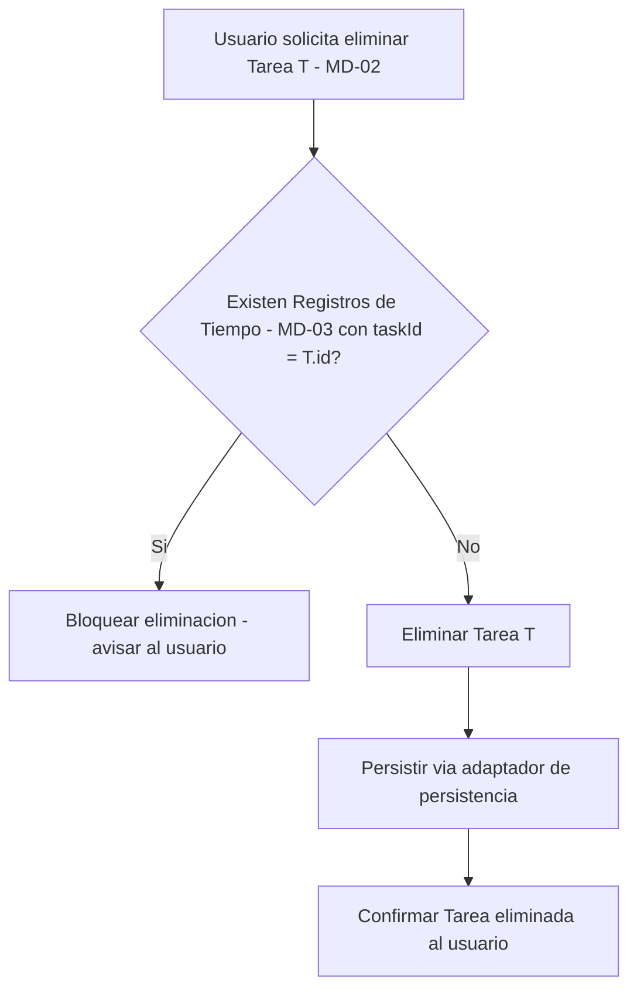
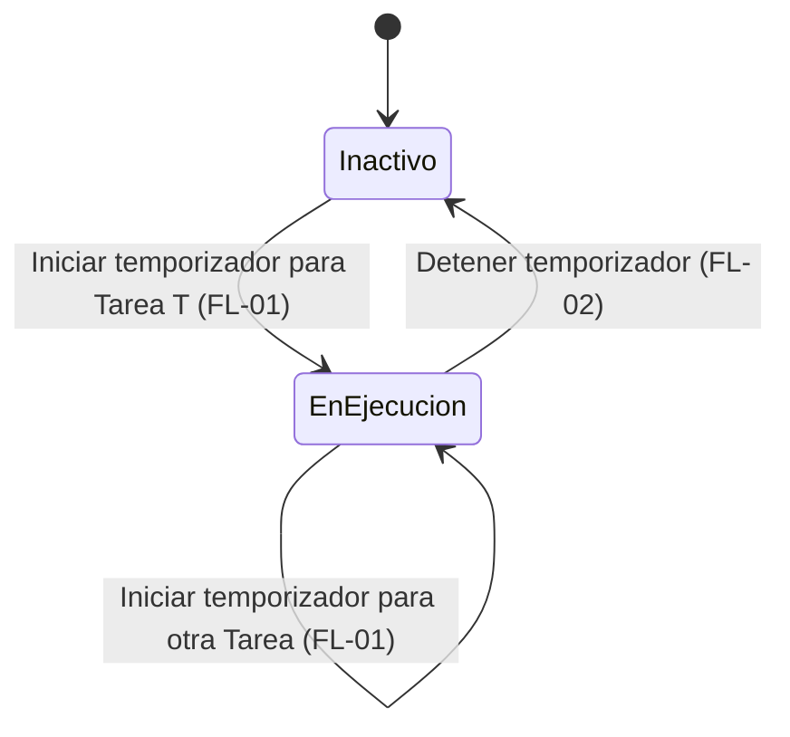

# Capability: Time Tracker

**Fecha de creación:** 2026-07-30
**Última actualización:** 2026-07-30

## Propósito

Documenta el modelo de datos de dominio (Proyecto, Tarea, Registro de Tiempo), los flujos técnicos de control de tiempo (temporizador, registro manual y cálculo de totales) y los flujos de gestión (creación, edición y eliminación) de Proyectos y Tareas del producto "Time Tracker", como referencia de implementación para las historias de usuario US-001 a US-004 derivadas de [SRS-001](../requirements/SRS-001-timetracker-app/README.md). No cubre criterios de aceptación de negocio ni el diseño visual de la interfaz (ver las US y [DESIGN.md](../../../DESIGN.md)/Figma), ni decisiones de arquitectura (ver [ADR-011](../../adr/ADR-011-persistencia-local-con-web-storage-api.md) y [ADR-012](../../adr/ADR-012-separacion-store-raiz-y-stores-de-feature.md), que fijan el mecanismo de persistencia y la separación entre store raíz y stores de feature usados por los flujos de este documento).

**Nota de alcance (FL-05 a FL-08):** editar y eliminar Proyectos y Tareas no estaban contemplados originalmente en el SRS-001 (sin RF asociado); se incorporan como ampliación de alcance confirmada para US-002 (Gestión de Proyectos) y US-003 (Gestión de Tareas y Registro de Tiempo).

Convención de nombres: el encabezado de cada modelo usa el término de dominio en español (alineado con el [glosario](../glossary.md) y el SRS); los nombres de campo se listan en inglés `camelCase`, conforme a [ADR-013](../../adr/ADR-013-convenciones-de-codigo-google-style-guide.md) (identificadores de código en inglés).

## Modelos de datos

### MD-01: Proyecto (Project)

Entidad persistida en el almacenamiento local (`localStorage`, ver ADR-011).

| Campo       | Tipo             | Requerido | Descripción                      | Validaciones / restricciones                                                                                                |
| ----------- | ---------------- | --------- | -------------------------------- | --------------------------------------------------------------------------------------------------------------------------- |
| id          | string (UUID v4) | Sí        | Identificador único del Proyecto | Generado por el sistema; inmutable                                                                                          |
| name        | string           | Sí        | Nombre del Proyecto              | RF-001: obligatorio; no vacío tras recortar espacios. Longitud máxima y unicidad no definidas en el SRS (ver Observaciones) |
| description | string           | No        | Descripción del Proyecto         | RF-001: opcional; sin restricción adicional definida en el SRS                                                              |

**Relaciones:** Proyecto 1—N Tarea (MD-02)

### MD-02: Tarea (Task)

Entidad persistida en el almacenamiento local (`localStorage`, ver ADR-011).

| Campo     | Tipo             | Requerido | Descripción                        | Validaciones / restricciones                                                                                                                      |
| --------- | ---------------- | --------- | ---------------------------------- | ------------------------------------------------------------------------------------------------------------------------------------------------- |
| id        | string (UUID v4) | Sí        | Identificador único de la Tarea    | Generado por el sistema; inmutable                                                                                                                |
| projectId | string (UUID v4) | Sí        | Proyecto al que pertenece la Tarea | RF-003; Restricción 2.4 del SRS: debe existir un Proyecto (MD-01) con este id. Relación N:1 obligatoria — una Tarea pertenece a un único Proyecto |
| name      | string           | Sí        | Nombre de la Tarea                 | RF-003: obligatorio; no vacío tras recortar espacios. Longitud máxima y unicidad dentro del Proyecto no definidas en el SRS (ver Observaciones)   |

**Relaciones:** Tarea N—1 Proyecto (MD-01); Tarea 1—N Registro de Tiempo (MD-03)

### MD-03: Registro de Tiempo (TimeEntry)

Entidad persistida en el almacenamiento local (`localStorage`, ver ADR-011).

| Campo           | Tipo                | Requerido   | Descripción                                | Validaciones / restricciones                                                                                                              |
| --------------- | ------------------- | ----------- | ------------------------------------------ | ----------------------------------------------------------------------------------------------------------------------------------------- |
| id              | string (UUID v4)    | Sí          | Identificador único del Registro de Tiempo | Generado por el sistema; inmutable                                                                                                        |
| taskId          | string (UUID v4)    | Sí          | Tarea a la que pertenece el registro       | Restricción 2.4 del SRS: debe existir una Tarea (MD-02) con este id. Relación N:1 obligatoria — un registro pertenece a una única Tarea   |
| source          | enum                | Sí          | Origen del registro                        | `timer` \| `manual`                                                                                                                       |
| date            | date (ISO 8601)     | Sí          | Fecha a la que se imputa el tiempo         | RF-011 (registro manual). Para `source = timer`, se asume derivada de `startTime` (ver Observaciones)                                     |
| durationMinutes | decimal             | Sí          | Duración del registro                      | RF-010/RF-013: siempre > 0; nunca 0 ni negativa. Unidad (minutos) asumida por este documento, no confirmada en el SRS (ver Observaciones) |
| startTime       | datetime (ISO 8601) | Condicional | Hora de inicio del temporizador            | RF-006/RF-009: requerido si `source = timer`; no aplica si `source = manual`                                                              |
| endTime         | datetime (ISO 8601) | Condicional | Hora de fin del temporizador               | RF-009: requerido si `source = timer`; no aplica si `source = manual`; debe ser posterior a `startTime`                                   |

**Relaciones:** Registro de Tiempo N—1 Tarea (MD-02)

## Flujos / Procesos

### FL-01: Iniciar temporizador para una Tarea

- **Disparador:** El usuario solicita iniciar el temporizador para una Tarea (RF-005).
- **Actores / componentes:** Usuario, store de feature Temporizador (ver ADR-012), adaptador de persistencia (ver ADR-011).
- **Resultado:** Existe un único temporizador activo en estado "En Ejecución" para la Tarea solicitada (Restricción 2.4 del SRS). Si existía un temporizador activo para otra Tarea, quedó detenido y su Registro de Tiempo (MD-03) persistido antes de iniciar el nuevo.

**Pasos**

1. El Usuario solicita iniciar el temporizador para la Tarea T (RF-005).
2. El store de feature Temporizador verifica si existe un temporizador activo, dado que solo puede haber uno en toda la aplicación (Restricción 2.4 del SRS).
3. Si existe un temporizador activo para otra Tarea, el store de feature lo detiene automáticamente: calcula su Duración, la valida (RF-010) y persiste su Registro de Tiempo (MD-03, `source = timer`) vía el adaptador de persistencia (RF-007), de forma equivalente a los pasos 1-4 de FL-02.
4. El store de feature guarda el nuevo estado "En Ejecución" con `startTime = ahora` y `taskId = T.id` (RF-006); el Registro de Tiempo de este nuevo temporizador se persiste al detenerlo (FL-02), no en este paso.
5. La interfaz refleja el temporizador activo para la Tarea T.

**Manejo de errores**

| Paso | Error posible                                                                                      | Comportamiento esperado                                                  |
| ---- | -------------------------------------------------------------------------------------------------- | ------------------------------------------------------------------------ |
| 3    | La Duración calculada del temporizador anterior resulta ≤ 0 (p. ej. desfase del reloj del sistema) | No especificado en el SRS — ver Observaciones                            |
| 1    | El usuario solicita iniciar el temporizador para la misma Tarea que ya está activa                 | No especificado en el SRS (¿no-op, reinicio, error?) — ver Observaciones |

### FL-02: Detener temporizador activo

- **Disparador:** El usuario solicita detener el temporizador activo (RF-008), o el paso 3 de FL-01 lo dispara automáticamente al iniciar uno nuevo para otra Tarea (RF-007).
- **Actores / componentes:** Usuario (o FL-01), store de feature Temporizador, adaptador de persistencia.
- **Resultado:** El Registro de Tiempo (MD-03, `source = timer`) queda persistido de forma inmediata; no queda temporizador activo (salvo que FL-01 inicie uno nuevo a continuación).

**Pasos**

1. El store de feature Temporizador registra `endTime = ahora` (RF-009).
2. Calcula `durationMinutes = endTime - startTime` (RF-009).
3. Valida que `durationMinutes` sea mayor que cero (RF-010).
4. Si es válida, construye el Registro de Tiempo (MD-03: `taskId`, `source = timer`, `date`, `startTime`, `endTime`, `durationMinutes`) y lo persiste de forma inmediata vía el adaptador de persistencia (RF-009, ADR-011).
5. Limpia el estado "En Ejecución" del store de feature.

**Manejo de errores**

| Paso | Error posible                                                | Comportamiento esperado                                                                  |
| ---- | ------------------------------------------------------------ | ---------------------------------------------------------------------------------------- |
| 3    | `durationMinutes` calculada ≤ 0                              | No especificado en el SRS qué mensaje o acción se muestra al usuario — ver Observaciones |
| 4    | Falla la escritura en `localStorage` (p. ej. cuota excedida) | No especificado en el SRS — ver Observaciones                                            |

### FL-03: Registrar tiempo manual

- **Disparador:** El usuario envía el formulario de registro manual de tiempo con Tarea, Fecha y Duración (RF-011).
- **Actores / componentes:** Usuario, feature de Registro Manual, adaptador de persistencia.
- **Resultado:** Registro de Tiempo (MD-03, `source = manual`) persistido en el almacenamiento local.

**Pasos**

1. El usuario ingresa `taskId`, `date` y `durationMinutes` y confirma (RF-011).
2. El sistema valida que `durationMinutes` sea mayor que cero (RF-013).
3. Si es válida, construye el Registro de Tiempo (MD-03: `taskId`, `source = manual`, `date`, `durationMinutes`) y lo persiste vía el adaptador de persistencia (RF-012).
4. La interfaz confirma al usuario que el registro fue creado.

**Manejo de errores**

| Paso | Error posible                                               | Comportamiento esperado                                                          |
| ---- | ----------------------------------------------------------- | -------------------------------------------------------------------------------- |
| 2    | `durationMinutes` ingresada ≤ 0                             | Rechazar el registro; el SRS no especifica el mensaje exacto — ver Observaciones |
| 1    | Tarea inexistente o no seleccionada                         | No especificado en el SRS — ver Observaciones                                    |
| 1    | Fecha ingresada fuera de un rango razonable (p. ej. futura) | No especificado en el SRS — ver Observaciones                                    |

### FL-04: Cálculo de totales de tiempo (Tarea, Proyecto, mes)

- **Disparador:** El usuario visualiza un reporte de totales acumulados por Tarea, por Proyecto o por mes (RF-015, RF-016, RF-017).
- **Actores / componentes:** Usuario, feature de Reportes, store raíz (lectura de Proyecto MD-01, Tarea MD-02, Registro de Tiempo MD-03).
- **Resultado:** Los totales solicitados se calculan y muestran en la interfaz.

**Pasos**

1. El usuario solicita ver el total por Tarea, por Proyecto o por mes.
2. Total por Tarea (RF-015): la feature de Reportes suma `durationMinutes` de todos los Registros de Tiempo (MD-03) cuyo `taskId` corresponde a esa Tarea.
3. Total por Proyecto (RF-016): la feature de Reportes suma los totales por Tarea (paso 2) de todas las Tareas (MD-02) cuyo `projectId` corresponde a ese Proyecto.
4. Total por mes (RF-017): la feature de Reportes suma `durationMinutes` de todos los Registros de Tiempo (MD-03) cuyo campo `date` cae dentro del mes seleccionado, sin filtrar por Tarea ni Proyecto.
5. La interfaz muestra el total calculado.

**Manejo de errores**

| Paso | Error posible                                              | Comportamiento esperado                                                                   |
| ---- | ---------------------------------------------------------- | ----------------------------------------------------------------------------------------- |
| 2-4  | No existen Registros de Tiempo para el criterio solicitado | No especificado en el SRS si se muestra 0 o un estado vacío explícito — ver Observaciones |

### FL-05: Editar Proyecto

- **Disparador:** El usuario solicita modificar el Nombre y/o la Descripción de un Proyecto (MD-01) existente.
- **Actores / componentes:** Usuario, feature de Gestión de Proyectos, adaptador de persistencia (ver ADR-011).
- **Resultado:** El Proyecto queda actualizado con el nuevo `name` y/o `description`; sus Tareas (MD-02) asociadas no se ven afectadas.

> Decisión de alcance confirmada: editar Proyectos no estaba contemplado originalmente en el SRS-001 (sin RF asociado); se incorpora como ampliación de alcance de US-002.

**Pasos**

1. El usuario selecciona un Proyecto existente (MD-01) y edita `name` y/o `description`.
2. El sistema valida que `name` no quede vacío tras recortar espacios (misma regla de obligatoriedad que en la creación del Proyecto, MD-01).
3. Si es válido, el sistema actualiza los campos modificados del Proyecto y lo persiste vía el adaptador de persistencia (ADR-011).
4. La interfaz confirma al usuario que el Proyecto fue actualizado.

**Manejo de errores**

| Paso | Error posible                                                | Comportamiento esperado                                                                       |
| ---- | ------------------------------------------------------------ | --------------------------------------------------------------------------------------------- |
| 2    | `name` queda vacío tras recortar espacios                    | Rechazar la edición; no persistir cambios. Mensaje exacto no especificado — ver Observaciones |
| 3    | Falla la escritura en `localStorage` (p. ej. cuota excedida) | No especificado — ver Observaciones                                                           |

### FL-06: Eliminar Proyecto

- **Disparador:** El usuario solicita eliminar un Proyecto (MD-01) existente.
- **Actores / componentes:** Usuario, feature de Gestión de Proyectos, adaptador de persistencia.
- **Resultado:** El Proyecto se elimina del almacenamiento local si no tiene Tareas asociadas; en caso contrario, la eliminación se bloquea y el Proyecto permanece sin cambios.

> Decisión de alcance confirmada: eliminar Proyectos no estaba contemplado originalmente en el SRS-001 (sin RF asociado); se incorpora como ampliación de alcance de US-002. La regla de bloqueo por Tareas asociadas es una decisión de producto confirmada en esta misma ampliación, no una regla preexistente del SRS.

**Pasos**

1. El usuario solicita eliminar el Proyecto P (MD-01).
2. El sistema verifica si existe al menos una Tarea (MD-02) cuyo `projectId` corresponda a P.
3. Si existe alguna, el sistema **bloquea** la eliminación y muestra un aviso al usuario indicando que debe eliminar o reasignar sus Tareas primero (no se persiste ningún cambio).
4. Si no existe ninguna, el sistema elimina el Proyecto P y persiste el cambio vía el adaptador de persistencia (ADR-011).
5. La interfaz confirma al usuario el resultado (bloqueo con aviso, o eliminación exitosa).

**Manejo de errores**

| Paso | Error posible                                                     | Comportamiento esperado                                                                                                                                                  |
| ---- | ----------------------------------------------------------------- | ------------------------------------------------------------------------------------------------------------------------------------------------------------------------ |
| 3    | El Proyecto tiene una o más Tareas asociadas (MD-02, `projectId`) | Bloquear la eliminación; mostrar aviso al usuario indicando que debe eliminar o reasignar sus Tareas primero. Texto exacto del aviso no especificado — ver Observaciones |
| 4    | Falla la escritura en `localStorage` (p. ej. cuota excedida)      | No especificado — ver Observaciones                                                                                                                                      |

### FL-07: Editar Tarea

- **Disparador:** El usuario solicita modificar el Nombre de una Tarea (MD-02) existente y/o reasignarla a otro Proyecto (MD-01).
- **Actores / componentes:** Usuario, feature de Gestión de Tareas, adaptador de persistencia.
- **Resultado:** La Tarea queda actualizada con el nuevo `name` y/o `projectId`; sus Registros de Tiempo (MD-03) asociados no se ven afectados (siguen enlazados a la misma Tarea por `taskId`, independientemente del Proyecto al que esta pertenezca).

> Decisión de alcance confirmada: editar Tareas (incluyendo reasignación de Proyecto) no estaba contemplado originalmente en el SRS-001 (sin RF asociado); se incorpora como ampliación de alcance de US-003.

**Pasos**

1. El usuario selecciona una Tarea existente (MD-02) y edita `name` y/o `projectId` (reasignación a otro Proyecto).
2. El sistema valida que `name` no quede vacío tras recortar espacios (misma regla de obligatoriedad que en la creación de la Tarea, MD-02).
3. Si se reasigna `projectId`, el sistema valida que exista un Proyecto (MD-01) con ese id (misma regla de validación que al crear la Tarea, MD-02 / Restricción 2.4 del SRS).
4. Si todas las validaciones aplicables son correctas, el sistema actualiza los campos modificados de la Tarea y la persiste vía el adaptador de persistencia (ADR-011).
5. La interfaz confirma al usuario que la Tarea fue actualizada.

**Manejo de errores**

| Paso | Error posible                                                             | Comportamiento esperado                                                                       |
| ---- | ------------------------------------------------------------------------- | --------------------------------------------------------------------------------------------- |
| 2    | `name` queda vacío tras recortar espacios                                 | Rechazar la edición; no persistir cambios. Mensaje exacto no especificado — ver Observaciones |
| 3    | El `projectId` destino no corresponde a ningún Proyecto (MD-01) existente | Rechazar la edición; no persistir cambios. Mensaje exacto no especificado — ver Observaciones |
| 4    | Falla la escritura en `localStorage` (p. ej. cuota excedida)              | No especificado — ver Observaciones                                                           |

### FL-08: Eliminar Tarea

- **Disparador:** El usuario solicita eliminar una Tarea (MD-02) existente.
- **Actores / componentes:** Usuario, feature de Gestión de Tareas, adaptador de persistencia.
- **Resultado:** La Tarea se elimina del almacenamiento local si no tiene Registros de Tiempo asociados; en caso contrario, la eliminación se bloquea y la Tarea permanece sin cambios.

> Decisión de alcance confirmada: eliminar Tareas no estaba contemplado originalmente en el SRS-001 (sin RF asociado); se incorpora como ampliación de alcance de US-003. La regla de bloqueo por Registros de Tiempo asociados es una decisión de producto confirmada en esta misma ampliación, no una regla preexistente del SRS.

**Pasos**

1. El usuario solicita eliminar la Tarea T (MD-02).
2. El sistema verifica si existe al menos un Registro de Tiempo (MD-03) cuyo `taskId` corresponda a T.
3. Si existe alguno, el sistema **bloquea** la eliminación y muestra un aviso al usuario (no se persiste ningún cambio).
4. Si no existe ninguno, el sistema elimina la Tarea T y persiste el cambio vía el adaptador de persistencia (ADR-011).
5. La interfaz confirma al usuario el resultado (bloqueo con aviso, o eliminación exitosa).

**Manejo de errores**

| Paso | Error posible                                                            | Comportamiento esperado                                                                                       |
| ---- | ------------------------------------------------------------------------ | ------------------------------------------------------------------------------------------------------------- |
| 3    | La Tarea tiene uno o más Registros de Tiempo asociados (MD-03, `taskId`) | Bloquear la eliminación; mostrar aviso al usuario. Texto exacto del aviso no especificado — ver Observaciones |
| 4    | Falla la escritura en `localStorage` (p. ej. cuota excedida)             | No especificado — ver Observaciones                                                                           |

## Diagramas

### DG-01: Diagrama de estados del Temporizador

- **Tipo:** Estados
- **Alcance:** Ciclo de vida del temporizador único de la aplicación (Restricción 2.4 del SRS); no incluye el ciclo de vida del Registro de Tiempo manual (FL-03).

**Notas**

- El estado `EnEjecucion` es único en toda la aplicación (Restricción 2.4 del SRS, RF-007): la transición de `EnEjecucion` a `EnEjecucion` representa la detención automática del temporizador anterior (FL-02) seguida del inicio del nuevo (FL-01) para una Tarea distinta — nunca dos temporizadores simultáneos.
- El SRS (sección 2.2) menciona "pausa" de temporizadores, pero ningún requisito funcional (RF-005 a RF-010) define un estado o transición de pausa; este diagrama modela únicamente los dos estados soportados por los RF (`Inactivo`, `EnEjecucion`). Ver Observaciones.

## Observaciones

- **MD-01/MD-02 (`name`):** el SRS no define longitud máxima ni unicidad para el nombre de Proyecto o Tarea (¿pueden existir dos Proyectos, o dos Tareas de un mismo Proyecto, con el mismo nombre?). Queda como pendiente para quien defina las US de Gestión de Proyectos (US-002) y Gestión de Tareas y Registro de Tiempo (US-003).
- **MD-03 (`durationMinutes`):** la unidad de duración (minutos) es una decisión técnica asumida por este documento; el SRS solo indica "Duración" sin especificar unidad ni precisión (¿minutos enteros, minutos decimales, segundos?). Confirmar antes de implementar la TK de persistencia de Registro de Tiempo.
- **MD-03 (`date`):** para registros de origen `timer`, se asume que `date` se deriva de `startTime` (fecha calendario de inicio). El SRS no aclara qué fecha corresponde a un temporizador que cruza la medianoche (inicio un día, fin al día siguiente).
- **FL-01 (paso 1):** no se especifica el comportamiento si el usuario solicita iniciar el temporizador para la misma Tarea que ya está activa (¿no-op, reinicio de `startTime`, error?).
- **FL-01/FL-02 (manejo de errores):** no se especifica qué mensaje o acción debe mostrarse al usuario si la Duración calculada al detener automáticamente el temporizador anterior resulta ≤ 0 (p. ej. por desfase del reloj del sistema).
- **FL-02 (manejo de errores):** no se especifica el comportamiento ante un fallo de escritura en `localStorage` (p. ej. cuota excedida) al persistir el Registro de Tiempo.
- **FL-03 (manejo de errores):** no se especifica el mensaje exacto ante una Duración ingresada ≤ 0, la validación de existencia/selección de la Tarea, ni restricciones sobre la Fecha ingresada (pasado/futuro).
- **FL-04 (manejo de errores):** no se especifica si un reporte sin Registros de Tiempo para el criterio solicitado debe mostrar `0` o un estado vacío explícito.
- **DG-01 / SRS 2.2:** la sección 2.2 del SRS ("Registro de Tiempo Automatizado: Inicio, **pausa** y detención de temporizadores") menciona una función de pausa que ningún requisito funcional (RF-005 a RF-010) llega a definir. Este documento modela únicamente Iniciar/Detener conforme a los RF vigentes; si "pausa" es una función real distinta de "detener", se requiere un RF/US adicional que la especifique (estados, si reanuda el mismo Registro de Tiempo o crea uno nuevo, etc.) antes de implementarla.
- **FL-05/FL-06/FL-07/FL-08 (manejo de errores):** el texto exacto de los mensajes/avisos mostrados al usuario (edición rechazada por nombre vacío, Proyecto destino inexistente al reasignar, aviso de bloqueo de eliminación por Tareas o Registros de Tiempo asociados) no está definido; queda pendiente para quien redacte las US-002/US-003 o el diseño de UI. El comportamiento ante fallo de escritura en `localStorage` en estos cuatro flujos tampoco está especificado (mismo pendiente ya registrado para FL-02).
- **FL-06/FL-08 (bloqueo de eliminación):** no se especifica si, tras el bloqueo, la interfaz debe ofrecer una acción directa para reasignar/eliminar las Tareas o Registros de Tiempo que impiden la eliminación, o si el usuario debe hacerlo manualmente desde otra pantalla. Queda como decisión de UI/UX pendiente.
