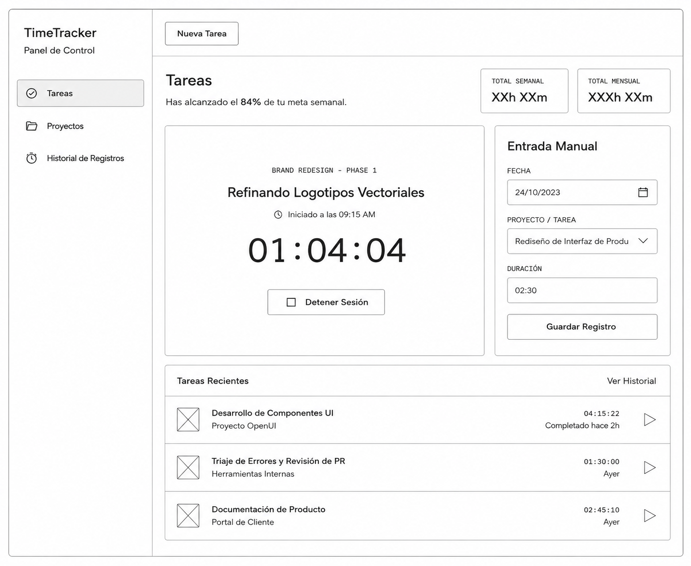

# US-003: Registro de tiempo con temporizador

Estado: Ready
Fecha de creación: 2026-07-06
Última actualización: 2026-07-06

## Descripción

**COMO** usuario
**QUIERO** iniciar y detener un temporizador sobre una Tarea
**PARA** registrar en tiempo real el tiempo que dedico a mi trabajo

## Contexto

Historia derivada de [SRS-001-timetracker-app](../../requirements/SRS-001-timetracker-app/README.md), sección 3.1.2 (Control de Tiempo Automatizado). Requiere que exista al menos una Tarea sobre la que iniciar el temporizador — ver [US-002](../US-002-gestion-de-tareas/README.md).

## Reglas de negocio

- **BR-01:** El sistema DEBE permitir solamente un (1) temporizador activo a la vez en toda la aplicación → verificado por AC-003
- **BR-02:** La Duración calculada al detener el temporizador NO DEBE ser menor o igual a cero → verificado por AC-006

## Criterios de aceptación

- **AC-001 (Casos de uso):** El sistema DEBE permitir al usuario iniciar un temporizador para una Tarea específica. [RF-005]
- **AC-002 (Procesamiento de datos):** Al iniciar un temporizador, el sistema DEBE guardar localmente el estado "En Ejecución" junto con la hora de inicio y el identificador de la Tarea. [RF-006]
- **AC-003 (Reglas de negocio):** Si el usuario inicia un temporizador mientras otro está activo en una Tarea diferente, el sistema DEBE detener automáticamente el temporizador anterior, calcular y guardar su Registro de Tiempo antes de iniciar el nuevo. [RF-007, BR-01]
- **AC-004 (Casos de uso):** El sistema DEBE permitir al usuario detener el temporizador activo. [RF-008]
- **AC-005 (Procesamiento de datos):** Al detener el temporizador, el sistema DEBE registrar la Hora Fin, calcular la Duración (Hora Fin − Hora Inicio) y persistir el Registro de Tiempo de forma inmediata en el almacenamiento local. [RF-009]
- **AC-006 (Reglas de negocio):** El sistema DEBE validar que la Duración calculada sea mayor que cero antes de persistir el Registro de Tiempo. [RF-010, BR-02]
- **AC-007 (Interacción de usuario):** La interfaz DEBE mostrar claramente el estado del temporizador (activo/inactivo) y la Tarea asociada. [RIU-004]
- **AC-008 (Eficiencia de rendimiento):** El sistema DEBE iniciar el temporizador en menos de 1 segundo desde la acción del usuario. [RP-001]
- **AC-009 (Eficiencia de rendimiento):** El sistema DEBE detener el temporizador y persistir el Registro de Tiempo en menos de 1 segundo desde la acción del usuario. [RP-002]
- **AC-010 (Fiabilidad):** El sistema DEBE recuperar los Registros de Tiempo generados por el temporizador de forma consistente tras un reinicio de la aplicación. [RFB-001, RFB-002]

### Escenarios de comportamiento

```gherkin
Escenario: SC-01 - Iniciar un temporizador mientras otro está activo en otra Tarea
DADO que el usuario tiene un temporizador "En Ejecución" para la Tarea A
CUANDO el usuario inicia un temporizador para la Tarea B
ENTONCES el sistema detiene automáticamente el temporizador de la Tarea A, calcula y persiste su Registro de Tiempo
Y el sistema inicia el temporizador para la Tarea B con su propia hora de inicio
```

---

## Complejidad sugerida

- **Story points:** 5
- **Justificación:** Mayor riesgo e incertidumbre que un CRUD simple por la regla de concurrencia (un solo temporizador activo, con corte y persistencia automática del anterior) y por los requisitos de rendimiento (RP-001/RP-002) que condicionan la implementación.

## Repositorios

- exercise-time-tracker

## Validación

### INVEST

| Letra | Criterio      | Resultado | Notas                                                                                                        |
| ----- | ------------- | --------- | ------------------------------------------------------------------------------------------------------------ |
| **I** | Independiente | Parcial   | Requiere que exista al menos una Tarea (US-002) sobre la que iniciar el temporizador.                        |
| **N** | Negociable    | Cumple    | El detalle de la interfaz del temporizador admite ajuste.                                                    |
| **V** | Valiosa       | Cumple    | Función central del producto: registro de tiempo en tiempo real.                                             |
| **E** | Estimable     | Cumple    | RF-005 a RF-010 y RP-001/RP-002 son suficientes para estimar.                                                |
| **S** | Pequeña       | Cumple    | Acotada a iniciar/detener y a la regla de concurrencia (BR-01); se mantiene unida por cohesión de esa regla. |
| **T** | Testeable     | Cumple    | AC-001 a AC-010 son verificables de forma objetiva.                                                          |

### Definition of Ready (DoR)

| Criterio DoR                       | Estado  | Notas                                                                                                                                                                      |
| ---------------------------------- | ------- | -------------------------------------------------------------------------------------------------------------------------------------------------------------------------- |
| Dependencias listas                | Parcial | Depende de US-002 (Gestión de Tareas), incluida en el mismo lote de definición.                                                                                            |
| Inputs/outputs claros              | Cumple  | Entrada: acción de iniciar/detener sobre una Tarea. Salida: Registro de Tiempo persistido.                                                                                 |
| Repositorios definidos             | Cumple  | exercise-time-tracker.                                                                                                                                                     |
| Sin decisiones técnicas pendientes | Cumple  | Ninguna.                                                                                                                                                                   |
| Referencias de UI                  | Cumple  | Wireframe "Tareas (panel principal)", que muestra el estado del temporizador — . |
| Sin aclaraciones pendientes        | Cumple  | Ninguna.                                                                                                                                                                   |

## Observaciones

- Depende de que exista al menos una Tarea (US-002, incluida en este mismo lote) para poder iniciar un temporizador.
- Fuera de alcance: función de "pausar" el temporizador. La sección §2.2 del SRS la menciona ("Inicio, pausa y detención") pero ningún RF-XXX la especifica; solo se cubren iniciar (RF-005) y detener (RF-008). Si se requiere pausa, deberá definirse en una historia adicional.
